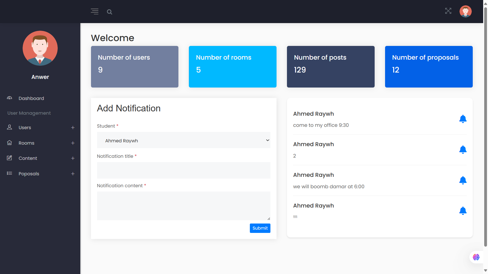
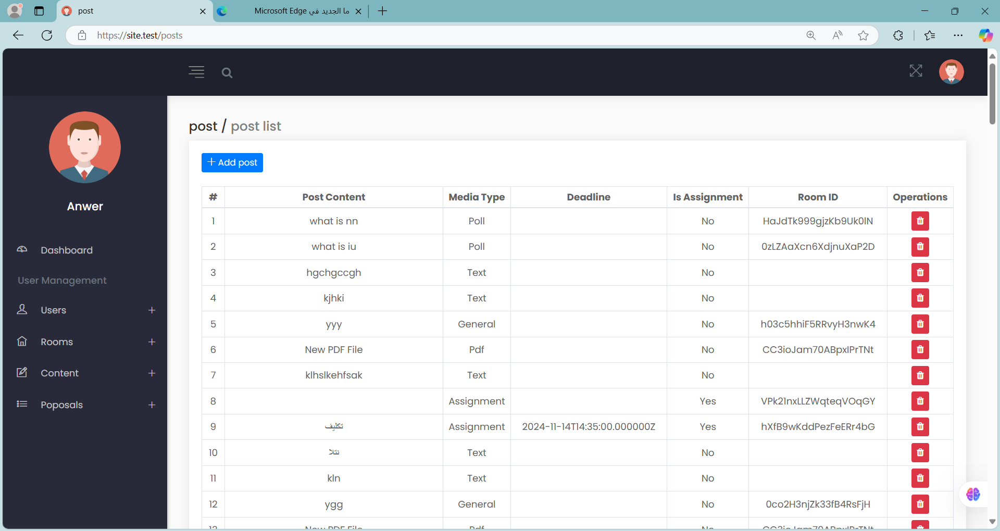
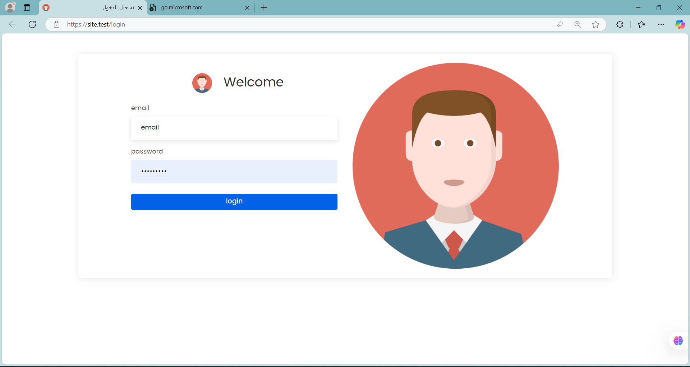

# 🧠 Smart Representative - Dashboard

Welcome to the **Dashboard** for the **Smart Representative** application — a smart and efficient solution built to streamline communication and data tracking for field representatives.

## 📋 What This Dashboard Does

This dashboard serves as the **administrative control center** for the Smart Representative mobile app. It provides essential tools for managing and overseeing operations, including:

- 🧑‍💼 Managing and viewing field representatives’ profiles and performance.
- 📊 Monitoring rep activities in real time.
- 📈 Preparing and exporting reports based on representative activity.
- 🔐 Securing access through Firebase Authentication.
- ☁️ Interacting with Firebase as the main database backend for storing dynamic data.

> ⚠️ **Note:** This is a **limited version** intended for internal use or demo purposes only. Some advanced features are still under development or hidden.

---

## 🛠️ Built With

- 🔧 [Laravel](https://laravel.com/) – Backend framework.
- 🎨 HTML5 – Page structure.
- 💅 CSS3 – Styling and layout.
- 🧩 JavaScript – Dynamic functionality.
- 🧱 Bootstrap – Responsive and clean UI components.
- 🔥 [Firebase](https://firebase.google.com/) – Used for:
  - Authentication (login and access control)
  - Real-time database functionality

---

## 📸 Preview




##

## 📦 Installation

If you’d like to install and run this dashboard locally:

```bash
git clone https://github.com/yourusername/smart-representative-dashboard.git
cd smart-representative-dashboard
composer install
cp .env.example .env
php artisan key:generate
php artisan migrate
php artisan serve